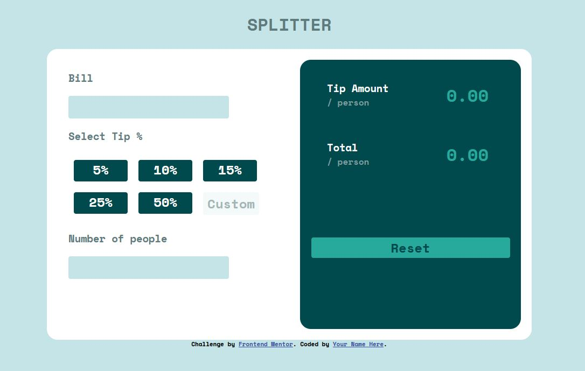

# Frontend Mentor - Tip calculator app solution

This is a solution to the [Tip calculator app challenge on Frontend Mentor](https://www.frontendmentor.io/challenges/tip-calculator-app-ugJNGbJUX). Frontend Mentor challenges help you improve your coding skills by building realistic projects.

## Table of contents

- [Overview](#overview)
  - [The challenge](#the-challenge)
  - [Screenshot](#screenshot)
- [My process](#my-process)
  - [Built with](#built-with)
  - [What I learned](#what-i-learned)
  - [Continued development](#continued-development)
  - [Useful resources](#useful-resources)
- [Author](#author)
- [Acknowledgments](#acknowledgments)

**Note: Delete this note and update the table of contents based on what sections you keep.**

## Overview

### The challenge

Users should be able to:

- View the optimal layout for the app depending on their device's screen size
- See hover states for all interactive elements on the page
- Calculate the correct tip and total cost of the bill per person

### Screenshot

()

## My process

### Built with

- Semantic HTML5 markup
- CSS custom properties
- Flexbox
- Mobile-first workflow
- Javascript
- DOM

### What I learned

In CSS, I learn how to set up input style to let radio button disappear and change style after checked.

- Set `radio` display: none

```CSS
.select {
  display: none;
}
```

- When radio checked, the css change the silbling `label`

  (if without `+label` , it only change the radio button when checked )

```CSS
input[type="radio"]:checked + label {
  color: hsl(183, 100%, 15%);
  background-color: hsl(173, 63%, 41%);
}
```

In javascript, I learn how to get the input value by DOM

- set event name `input`, we can get value when input number

```javascript
tip.addEventListener("input", getValueOfBill);
```

## Author

- Website - [Isis Lin](https://github.com/qweb321)
